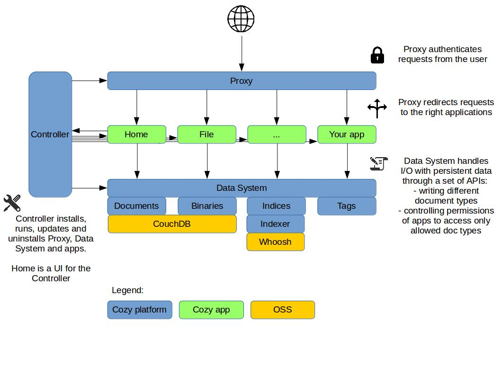
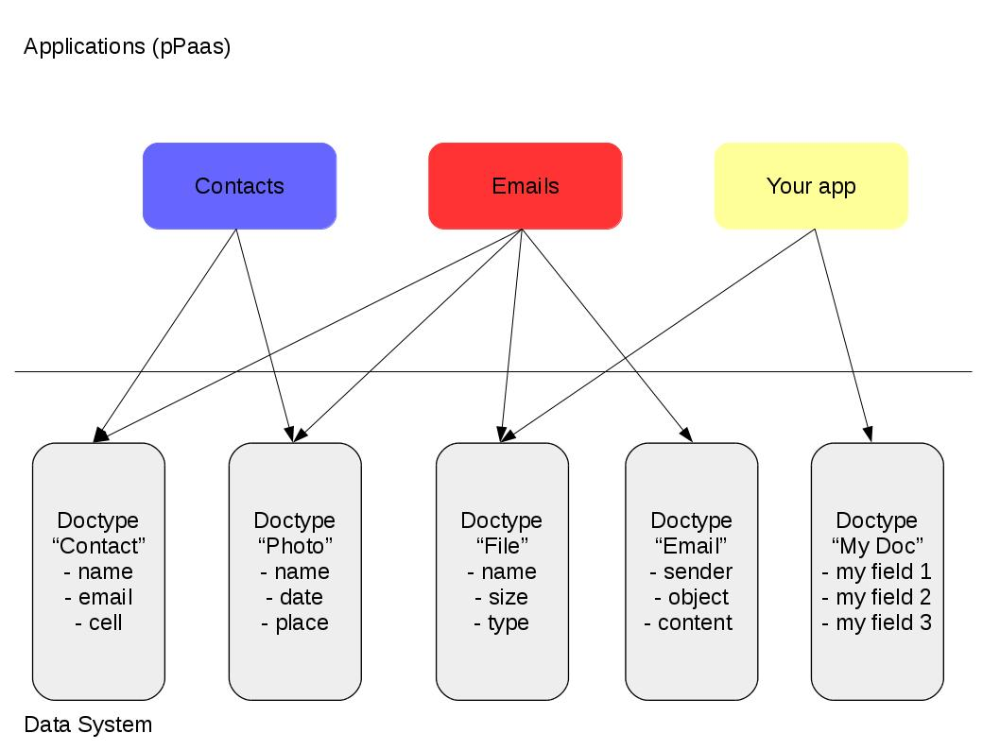

# Introduction

Welcome to the **Cozy Developer Space**.

Here you will find everything you need to understand Cozy technically and to develop applications and konnectors.

The **technical level required** to read and understand this documentation is not over 9,000; you will roughly have to:

 * Understand how the web works (both **client** and **server** side)
 * Read/Write **JavaScript**, **HTML** and **CSS**
 * Install and run a **Node.js** process
 * Be comfortable with **command-line** calls
 * Know that cookies are not made of flour


```javascript
console.log(" ╰(◕‿◕)╯ ");
```


## Why & How we made Cozy


Cozy is a **personal web deployment platform**, which enables you to quickly bootstrap applications and interact with your data. It stands on a server - between your application and the operating system - easing the pain of **system administration**, **web development** and **security**. Get your data back home!

### Data-oriented

The initial idea was to create a space where developers can **experiment and play with their data**, while remaining in control of the platform. A friendly centralized point to fetch data from Things-Of-Internet, devices and personal services.


More than a simple Platform-as-a-Service, Cozy puts the cloud back where it belongs: at home.

Find out more on the [Architecture section](#architecture-amp-components)


### Tools

Cozy also became our **daily working environment**, and we want it to be as comfortable as possible. It means that we require it to be flexible, extensible and usable. We use **Node.js** and **CouchDB** as our main technologies.


**Node.js** is a great and modern engine with a huge community of module creators. It has evolved along with the GitHub's Open-Source popularization and is now wide-spread in the Web industry. Aside from being heavily maintained, it remains fun to extend and play with.


**CouchDB** is surely less-known, but definitely reliable. As a proper Erlang program, it has proven its strength and stability. A consistent, well-documented API, plus wonderful replication capabilities: the recipe of what we love of a database engine.


## Developing with Cozy


“ *Cozy has been a great opportunity for me to start coding. Now I run a decent business.* ”
<small>Bill Getas - Startup entrepreneur</small>

“ *Thanks to Cozy, I successfully managed to build a working web application without a hassle.* ”
<small>Tim Bernee-Lers - enthusiast web developer</small>

“ *I'm sorry Dave, I'm afraid I can't do that.* ”
<small>HAL 9000 - CoffeeScript compiler</small>


But to be honest, we don't need these fancy references to convince you to develop on Cozy.


### To the future, Marty!

Cozy is a **modern web platform** that abstracts a lot of complexity out of personal **data manipulation**. If you are planning on developing a tool to **fetch**, **visualize** or **mix data**, a Cozy Application or a Konnector may be a good way to start.

By developing on Cozy, you will:

 * Reach a community of **enthusiast testers** and end-users
 * Learn how to make **single-page applications** with modern JavaScript frameworks like **Angular.js** or **React.js**
 * Be guided by [Cozy mentors](#mentorship), JavaScript gurus and other contributors
 * Enjoy the **built-in security** of Cozy

And whatever the reason, you will always find a friendly team member to help you dealing with your struggles and questions on the [IRC channel](#irc).

**So let's dive into it**!


# Getting Started

This section is a quick tutorial showing the different steps to start using Cozy as a development environment, making a simple app, and interact with your data.

## Set up the Development Environment

Since Cozy is made from several pieces, we wrapped it into an **easy-to-use Virtual Machine**, so you don't clutter your local system. This also means you can use the operating system you like! Well, there are obviously issues on Windows, so we will assume here that you use a **GNU/Linux system or Mac OS X**.

The environment is made of two parts: the Virtual Machine itself - a fully installed Cozy platform - and a local Node.js tool called `cozy-dev` which will help you getting started and deploying your app to your Cozy.

### 1. Install Git

 > On GNU/Linux, just install Git with your package manager

```shell
apt-get install git
```

 > On Mac OS, download the software here: <br>
 > <a href="http://git-scm.com/download/mac">http://git-scm.com/download/mac</a>

```shell
# To check if Git is installed
git --version
```

The first step is obviously to install the development dependencies. Git is the [SCM](https://en.wikipedia.org/wiki/Version_control) we use at Cozy, and if you don't know how to use it yet, don't worry: we will give example commands in the following tutorial.


### 2. Install Node.js

 > On Debian GNU/Linux Jessie, one of the proper version of Node.js (0.10.29) is available in the official repositories

```shell
apt-get install nodejs nodejs-legacy npm
```

 > On other GNU/Linux systems, you can install Node.js manually by following
 > instructions from https://nodejs.org/en/download/package-manager/

 > On Mac OS X, simply download the package, and install it <br>
 > <a href="https://nodejs.org/dist/v4.3.0/node-v4.3.0.pkg">https://nodejs.org/dist/v4.3.0/node-v4.3.0.pkg</a>

```shell
# To check the Node.js version
node --version
```

Installing Node.js on your local environment is necessary to run your app and
use `cozy-dev`. Cozy runs well on <strong>Node.js v0.10</strong> and
<strong>Node.js 4.3</strong>, and you should install one of those versions.

You can find detailed instructions of installation on the [official page](https://nodejs.org/en/download/).


### 3. Install VirtualBox and Vagrant

**VirtualBox** is used to emulate a full Operating System in a Virtual Machine. You can download it from [The Virtualbox website](https://www.virtualbox.org/wiki/Downloads). Make you have the latest version installed!

**Vagrant** is a Command-Line Interface to interact with VirtualBox and handle development environment easily. You can download it from [The Vagrant website](https://www.vagrantup.com/downloads.html). Make you have the latest version installed!

<aside class="notice">
On Debian GNU/Linux 8, <code>virtualbox</code> and <code>vagrant</code> are available in the official repositories.
</aside>


### 4. Install <code>cozy-dev</code>

```shell
# Use the -g option to install system-wide
sudo npm install -g cozy-dev
```

As mentionned above, `cozy-dev` is a set of tools aiming to help you managing your app deployment and your development environment. It is recommended to install it system-wide.

The full documentation of `cozy-dev` can be found below on the [related section](#cozy-development-environment).


### 5. Download and start the environment

```shell
# Create a development directory
mkdir cozy && cd cozy

# Download the environment
cozy-dev vm:init

# Start the environment
cozy-dev vm:start

# Check that the environment is properly started
cozy-dev vm:status

# Update the environment (strongly recommended)
cozy-dev vm:update
```

Use `cozy-dev` to initialize the environment.
It is recommended to **update it** at the end because we do not necessarily maintain the raw image in an up-to-date state, as a new version of Cozy can be released every couple of weeks ☺

<aside class="notice">
The command <code>cozy-dev vm:init</code> can take a few minutes to complete as it downloads the full environment. You only have to do it once though.
</aside>

<aside style="clear: both" class="success">
You should now be able to go to <a href="http://localhost:9104">http://localhost:9104</a>! ☺
</aside>

## Introduction to Cozy Cloud architecture
Before writing code, let's have an overview of the Cozy Cloud architecture. The platform is made of 3 main components:

* the proxy handles user authentication. Your app will not have to deal with it, nor anything user related, because Cozy has a single user.
* the data system is a wrapper for CouchDB, which handles authorization and permission of applications when they access data.
* the pPaaS (personal Platform as a Service) is what installs, updates, uninstalls, starts and stops applications in the platform. You do not have to think about deployment!

The Cozy Cloud architecture is detailed in a <a href="#architecture-and-components">specific part</a>.

# Write your own application

From this point onward, you have a choice to make:

## Client-side application

If you want to make a simple app that only manipulates data inside the Cozy (no sharing, no accessing an external API), head over to the <a href="./clientsideapp.html">Client-side apps section</a>.

## Node.js application

If you want to make a powerful app using node.js, which manipulates files, accesses remote APIs or allows access to a cozy visitor with complex rules, go to the <a href="./nodeapp.html">Node.js app</a>.

# Understanding the platform

## Architecture and Components

Understanding how the platform is built is essential to be able to work with it.

The following figure displays the different parts of Cozy, that we are going to describe.



Cozy is made of three main components: a persistent layer, the [Data System](###The Data System), the [personal Platform as a service](###The pPaas) and the [platform interface](###The platform interface).

### The Data System

[Gihub repository](https://github.com/cozy/cozy-data-system/)

Personal data is at the core of Cozy, therefore the Data System is the central piece of Cozy where all your data is safely stored and ready to be used.

The Data System is a unified API which consists of:
- the database itself, CouchDB, where all your personal data and Cozy data is stored as document, each document having a type depending on the data it contains (a contact, an email, a setting)
- binaries, stored in CouchDB too, that in particular allow to authenticate and authorize requests made by Cozy so that resources (apps for example) can only access the document types they are allowed to access
- the indexer

It is important to emphasize here that the Data System owns the data, and decides whether the requests made by the Cozy platform are allowed or not.

You can find the complete API and details about the Data System on the [dedicated cookbook](https://docs.cozy.io/en/hack/cookbooks/data-system.html).

### The pPaas

[Github repository](https://github.com/cozy/cozy-controller/)

The personal Platform as a service, or pPaas, is an execution environment for applications collaborating around personal data. It consists mainly of the Controller, which installs, runs, updates and removes applications within Cozy. You can call the Controller using the Home, which is itself an application installed by the Controller. There is also a command line interface, cozy-monitor, that allows you to call the Controller if you have root privileges on your server.



The Controller therefore manages applications. These applications will store their data in the Data System. As we have seen, the Data System, not the application, owns the data. Therefore, when installing or updating an application, the user will be prompted to grant the application access to certain document types. This paradigm enables easy and straightforward collaboration between the applications: granting access to the "Contact" document type to both the Contacts application and the Emails one will allow to send an message in Emails to someone the user will have informed the contact details in Contacts. And this is a common, nearly boring example, but it can be done with any document type and any data!

Moreover, uninstalling or breaking an application will not erase your data, you will be able to recover it.

### The platform interface

The platform interface consists of the Home ([Gihub repository](https://github.com/cozy/cozy-home/)) and the Proxy ([Gihub repository](https://github.com/cozy/cozy-proxy/)).

As we have seen above, Home is an interface to the Controller which allows the user to manage applications in Cozy.

Up to now, we have seen that the Data System owns the data, that the Controller can manage applications and that applications can interact with data in the Data System. How can the user access all this data? The Proxy will enable it, and is the last part of the Cozy platform. It handles authentication and authorization in Cozy. It manages registration, login, logout and password reset. It also handles all the routing of Cozy (to send the right request to the right application).

If you want to learn more about authentication and authorization in Cozy, there is a [dedicated cookbook](https://docs.cozy.io/en/hack/cookbooks/authentication-authorization-workflows.html) on the subject.


### What you should remember

As a developer, you are going to create an application that will be run by Cozy's pPaaS. That application will access the data through the Data System. Also, you won't have to bother with user authentication and authorization because it is all handled by the Proxy.

Keep in mind you're developing for a **personal** environment. It might be something you are not  used to at first. It changes the relationship to data we had until now!

**With these three presentations, you have a clear view on the architecture of the Cozy platform, and we will now details a bit more several subjects.**

## Authentication and permissions
We haven't moved all the resources to the new documentation website. For the time being, we advise you to check the [old documentation website](https://docs.cozy.io/en/hack/getting-started/architecture-overview.html).

## Encryption management
We haven't moved all the resources to the new documentation website. For the time being, we advise you to check the [old documentation website](https://docs.cozy.io/en/hack/getting-started/architecture-overview.html).


# References

You can find the old documentation [here](https://docs.cozy.io/en/hack/cookbooks/).

## Data System API
We haven't moved all the resources to the new documentation website. For the time being, we advise you to check the [old documentation website](https://docs.cozy.io/en/hack/cookbooks/data-system.html).

## Cozy DB API
We haven't moved all the resources to the new documentation website. For the time being, we advise you to check the [old documentation website](http://cozy.github.io/cozy-db/doc/DOCINDEX.md.html).

## Controller API
We haven't moved all the resources to the new documentation website. For the time being, we advise you to check the [old documentation website](https://docs.cozy.io/en/hack/cookbooks/controller.html).

## Cozy Development Environment
We haven't moved all the resources to the new documentation website. For the time being, we advise you to check the [old documentation website](https://docs.cozy.io/en/hack/cookbooks/understanding-dev-environment.html).

## Main document types

All Cozy apps produce many data as JSON document that can be reused in your own application. The
main document types available are the following ones:

Doc Type | Main Fields
-------- | -----------
BankOperation | title, date, amount
Bill | type, vendor, date, amount
BloodPressure | systolic, diastolic
Bookmark | title, url, tag
Commit | sha, parent, tree, url, author, email, message, additions, deletions, files
Contact  | datapoints, n, fn, org, title, bday, department
Event    | start, end, description, place, rrule
File     | name, path, class, lastModification, creationDate, size, mime, checksum
Folder   | name, path, lastModification, creationDate
Email    | headers, from, to, cc, bcc, replyTo, subject, text, html, date, attachments, inReplyTo
Note     | title, content, creationDate, lastModificationDate
Photo    | title, description, orientation, binary
Sleep    | deepSleepDuration, lightSleepDuration, sleepDuration
Steps    | distance, steps
UseTracker | dateStart, dateEnd, duration, app
Weight | weight, leanWeight, fatWeight
Tasky | creationDate, completionDate, description, tags

# Getting help
## IRC
You can find help from the team or from a loving member of our community on `irc.freenode.net`, channel #cozycloud.
You can use the [webchat](https://webchat.freenode.net/) if you like!

## Forum
Our community is quite active on our [forum](https://forum.cozy.io/), mostly users willing to report bugs or ask for features. As a developer, no doubt you will get constructive feedbacks if you ask there!

## Email
You can always contact the team by sending an email at contact[at]cozycloud.cc.

## GitHub
You will find all the repositories under the [cozy organization](https://github.com/cozy/) and the [cozy-labs organization](https://github.com/cozy-labs/).

## Mentorship
We have a special mentoring program for developers looking for help!
A member of Cozy's team will spend 2 hours a week with you to help you developing your application!
You can find all the details [here](https://forum.cozy.io/t/mentorship-program/529).
